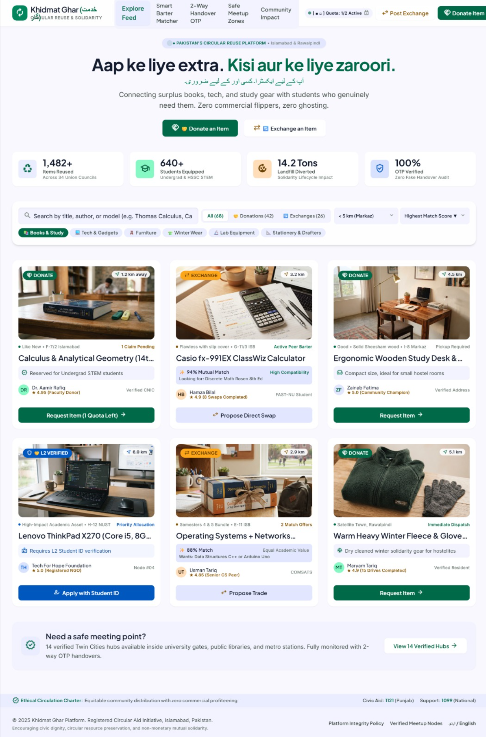
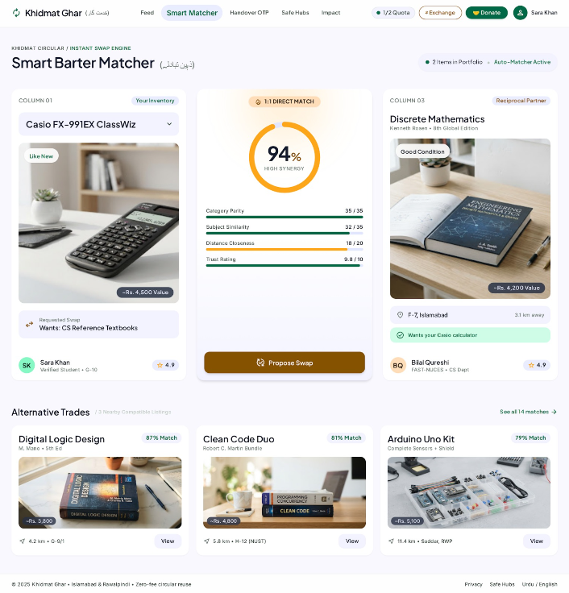
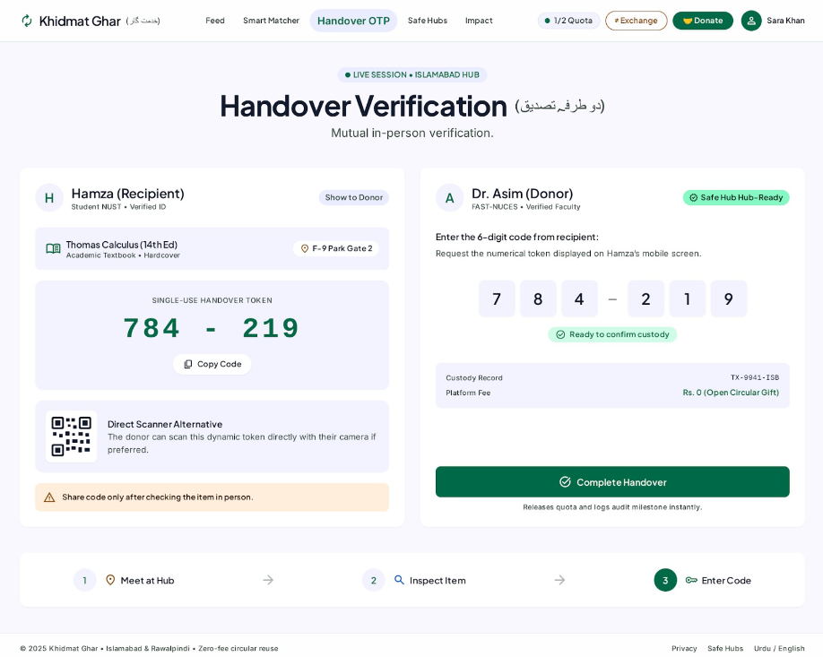
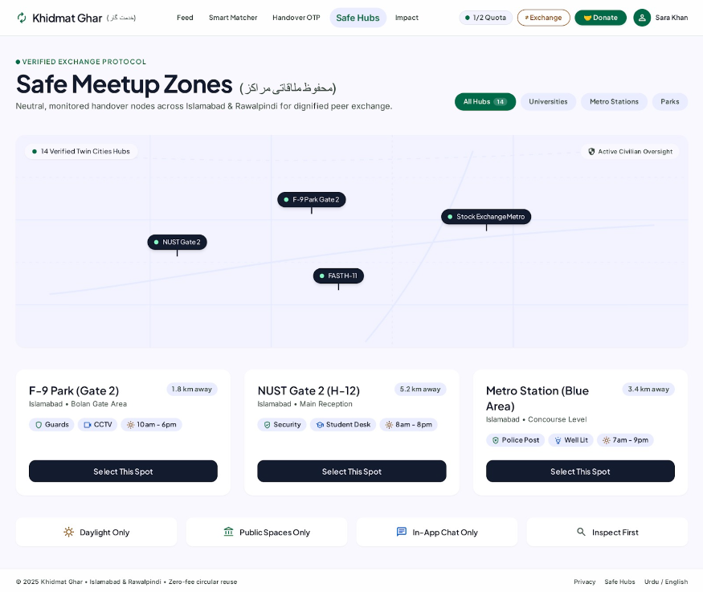
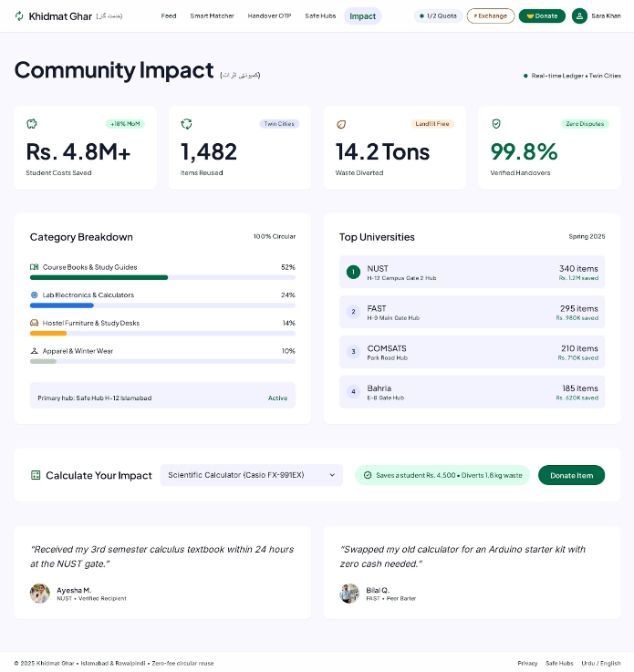
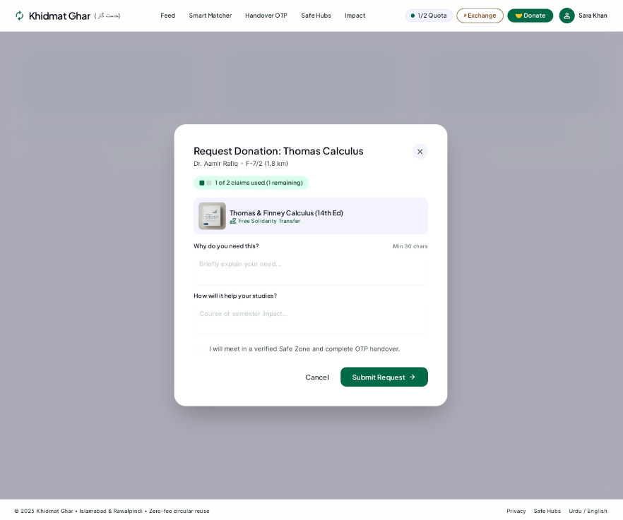

# ♻️ Khidmat Ghar (خدمت گار)
### *“Aap ke liye extra. Kisi aur ke liye zaroori.”*
> **English:** *“Extra for you. Essential for someone else.”*  
> **Domain:** Circular Reuse, Need-Based Donation & Peer-to-Peer Barter Platform  
> **Course:** Software Engineering Project

---

## 📖 Project Overview
**Khidmat Ghar** is an intelligent circular economy web platform designed for academic communities and households in urban Pakistan (Islamabad / Rawalpindi).

The platform operates on the core software engineering rule: **DONATION ≠ FREE MARKETPLACE**. By uniting strict active claim quotas with multi-factor barter matching and an on-site 2-way cryptographic verification handshake, Khidmat Ghar ensures usable academic books, calculators, electronics, and study furniture reach genuine students rather than commercial flippers.

---

## 🎯 Key System Features

1. **🤝 Need-Based Donation & Anti-Hoarding Quota:** Users can have a maximum of **2 active donation requests** at any time. Requires a verified Reason of Need and Academic Impact statement.
2. **🔄 Smart Barter Matcher (ذہین تبادلہ):** An algorithmic zero-cash swap engine calculating multi-factor compatibility (Category, Syllabus Correlation, Distance, and Civic Trust).
3. **🔐 Two-Way Handover OTP Protocol (دو طرفہ تصدیق):** A mutual verification handshake where the recipient reveals a dynamic 6-digit code (`784-219`) only after physically inspecting the item.
4. **📍 Verified Safe Meetup Hubs (محفوظ ملاقاتی مراکز):** A directory of 14 vetted public meeting points (NUST, FAST, F-9 Park, Metro stations) ensuring safety and privacy.
5. **📊 Community Impact Dashboard (کمیونٹی اثرات):** Real-time tracking of student expenses saved (PKR) and environmental waste diverted.

---

## 🎨 User Interface & Prototype

The UI is built using clean, accessible web standards: **HTML5, CSS3, and Vanilla JavaScript**.

| 01. Explore Feed | 02. Smart Barter Matcher |
| :---: | :---: |
|  |  |

| 03. Handover OTP | 04. Safe Meetup Hubs |
| :---: | :---: |
|  |  |

| 05. Community Impact | 06. Donation Claim Modal |
| :---: | :---: |
|  |  |

---

## 📑 Documentation
The complete 7-page academic Software Engineering project documentation is available in the repository root:
👉 **[Khidmat_Ghar_Project_Documentation.pdf](Khidmat_Ghar_Project_Documentation.pdf)**

---

## 🛠️ Technology Stack
* **Frontend:** HTML5, CSS3 (Custom Variables, Flexbox, Grid), Vanilla JavaScript (ES6+)
* **State & Persistence:** Browser `localStorage`
* **Design Theme:** High-Empathy Circularity (Emerald `#059669`, Amber `#F59E0B`, Slate `#0F172A`)
